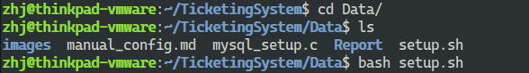
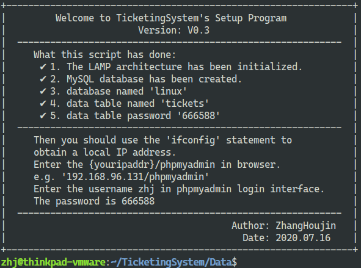

## 环境配置——自动部署方式

推荐使用[手动配置方式](manual_config.md)

自动部署方式直接运行`Data/setup.sh`脚本即可，例子如下

自动部署方式会实现LAMP安装并完成MySQL的相关配置

> 注意：执行过程中需要按几次回车，PHPMyAdmin安装时需要手动输入密码 `666588`

执行完成后的终端界面如下所示

之后您可以根据上述提示，登录PHPMyAdmin界面查看具体的数据库内容
