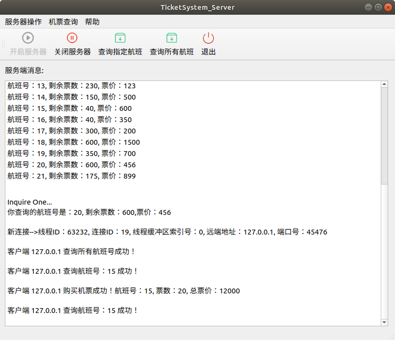
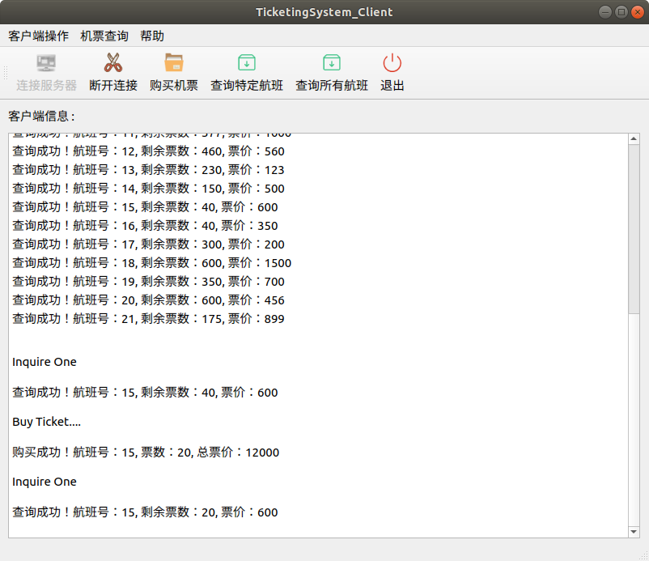
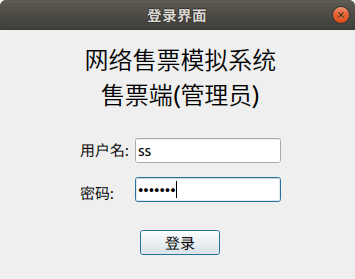
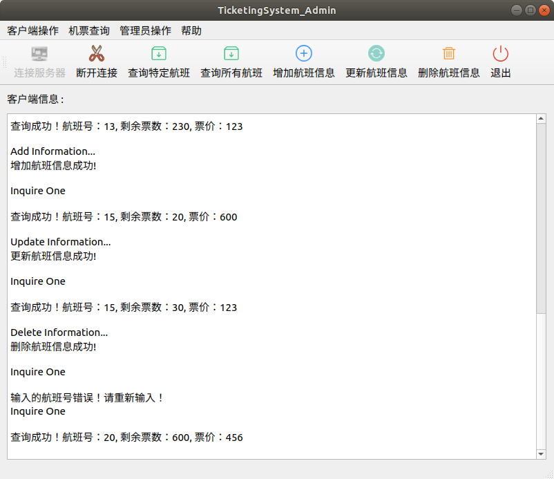
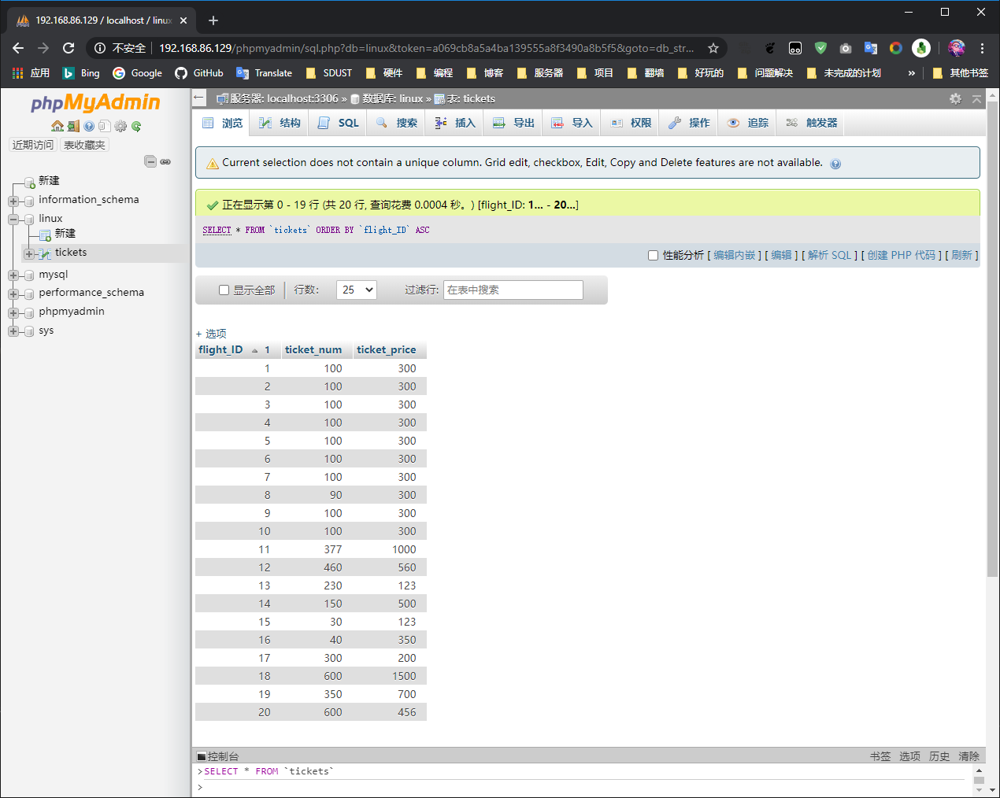
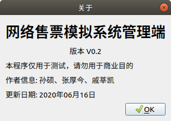

# TicketingSystem

> 由于众所周知的原因，GitHub里的图片可能加载不出来。您可以前往[本项目的Gitee仓库](https://gitee.com/zhj0125/TicketingSystem)，查看相关图片内容。

Linux C 机票网络售票系统

## 零、开发环境

项目开发时使用的软件版本如下，您也可以使用其他版本，理论上其它版本的软件也可以兼容本项目

|  软件  |   版本  | 下载方式 |
|--------|------- |----------|
| VMware | VMware® Workstation 16 Player 16.1.0 build-17198959 | [官方下载链接](https://www.vmware.com/cn/products/workstation-player.html) |
| Ubuntu | ubuntu-18.04.5-desktop-amd64   | [清华镜像下载](https://mirrors.tuna.tsinghua.edu.cn/ubuntu-releases/18.04.5/ubuntu-18.04.5-desktop-amd64.iso) |
| QT     | qt-opensource-linux-x64-5.11.1 | [官方下载链接](https://download.qt.io/new_archive/qt/5.11/5.11.1/qt-opensource-linux-x64-5.11.1.run) |
| LAMP   | Apache-2.4.29 / MySQL-5.7.33 / PHP-7.2.24 | 命令行下载，详见下文 |

## 一、环境配置

本项目中的航班信息存储使用了MySQL数据库，数据库的前端显示使用了LAMP架构，运行程序前需要进行相关配置

环境配置可以选择使用[自动部署](Data/auto_config.md)脚本或者进行[手动配置](Data/manual_config.md)

这两种方式选择一种即可，***推荐使用手动配置方式***

执行完上述配置后，数据库和LAMP的部分就配置好了

接下来您可以打开`Qt for Linux`软件，运行`TicketingSystem_Server`、`TicketingSystem_Client`和`TicketingSystem_Sell`三个文件夹中的QT程序进行测试

---

## 二、项目展示

👉 [航班网络售票模拟系统展示视频 - BiliBili](https://www.bilibili.com/video/BV14T4y1J7bt/) 👈

> 由于众所周知的原因，GitHub仓库里的图片可能加载不出来。您可以前往[本项目的Gitee仓库](https://gitee.com/zhj0125/TicketingSystem)，查看相关图片内容。

### 2.1 服务端

### 2.2 客户购票端

* 客户购票端欢迎界面

* 客户购票端

### 2.3 管理员售票端

* 管理员售票端登录界面

* 管理员售票端

### 2.4 数据库界面

### 2.5 关于我们

---

## 三、项目代码说明

Gitee 仓库地址（推荐）： [https://gitee.com/zhj0125/TicketingSystem](https://gitee.com/zhj0125/TicketingSystem)

GitHub 仓库地址： [https://github.com/ZHJ0125/TicketingSystem](https://github.com/ZHJ0125/TicketingSystem)

该代码是在《LINUX C编程从入门到精通》（刘学勇编著 ISBN:978-7-121-17415-5）书中例题的基础上修改的。如果您对代码有任何疑问或修改意见，欢迎提出[issue](https://gitee.com/zhj0125/TicketingSystem/issues) 或者直接私信我们，谢谢。
