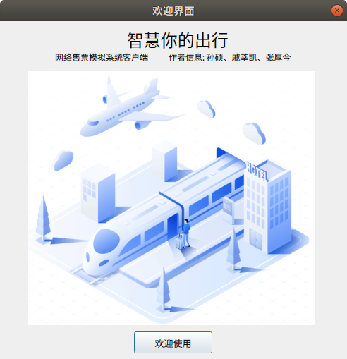

# TicketingSystem

Linux C 机票网络售票系统

## 一、运行环境配置

本项目中的航班信息存储使用了MySQL数据库，运行程序前，请确保按照如下步骤配置数据库

### 1.1 搭建LAMP环境

* 安装Apache

```bash
sudo apt-get update
sudo apt-get install apache2
```

* 安装PHP

```bash
sudo apt-get update
sudo apt-get install php
```

* 安装MySQL数据库

```bash
sudo apt-get install mysql-client mysql-server
sudo apt-get install libmysqlclient-dev
```

* 安装PHPMyAdmin

```bash
sudo apt-get install phpmyadmin
ln -s /usr/share/phpmyadmin /var/www/html/phpmyadmin
```

* 测试LAMP环境

使用ifconfig语句获取本地IP地址，在浏览器地址栏中输入`ip/phpmyadmin`，如：`192.168.96.131/phpmyadmin`，若出现PHPMyAdmin界面则表示LAMP环境配置成功。

### 1.2 数据库配置

* MySQL命令行操作

在Ubuntu终端中输入以下命令进入MySQL命令行界面

```bash
sudo mysql -u root
```

* 创建数据库

使用以下语句创建新的数据库用户

```bash
CREATE USER 'zhj'@'localhost' IDENTIFIED BY '666588';
GRANT ALL PRIVILEGES ON *.* TO 'zhj'@'localhost' WITH GRANT OPTION;
create database linux;
FLUSH PRIVILEGES;
```

* 验证数据库安装

在终端输入以下语句，若存在linux数据库，则表示创建成功。

```bash
sudo mysql -u root
show database;
```

数据库配置过程的完整操作示例如下：

```bash
zhj@vmware:~$ sudo mysql -u root
Welcome to the MySQL monitor.  Commands end with ; or \g.
Your MySQL connection id is 45
Server version: 5.7.30-0ubuntu0.18.04.1 (Ubuntu)

Copyright (c) 2000, 2020, Oracle and/or its affiliates. All rights reserved.

Oracle is a registered trademark of Oracle Corporation and/or its
affiliates. Other names may be trademarks of their respective
owners.

Type 'help;' or '\h' for help. Type '\c' to clear the current input statement.

mysql> CREATE USER 'zhj'@'localhost' IDENTIFIED BY '666588';
Query OK, 0 rows affected (0.00 sec)

mysql> GRANT ALL PRIVILEGES ON *.* TO 'zhj'@'localhost' WITH GRANT OPTION;
Query OK, 0 rows affected (0.00 sec)

mysql> FLUSH PRIVILEGES;
Query OK, 0 rows affected (0.01 sec)

mysql> create database linux;
Query OK, 1 row affected (0.00 sec)

mysql> show databases;
+--------------------+
| Database           |
+--------------------+
| information_schema |
| linux              |
| mysql              |
| performance_schema |
| phpmyadmin         |
| sys                |
+--------------------+
6 rows in set (0.00 sec)

mysql> quit
Bye

```

至此，您已经配置好了本项目所需的数据库。接下来需要使用C语言程序创建数据表。

* 创建数据表

进入到项目的`/TicketingSystem/Data`目录下，执行以下语句编译并执行C程序

```bash
gcc mysql_setup.c -o mysql_setup -lmysqlclient
./mysql_setup
```

完整操作示例如下：

```bash
zhj@vmware:~/TicketingSystem/Data$ ls
images  mysql_setup.c
zhj@vmware:~/TicketingSystem/Data$ gcc mysql_setup.c -o mysql_setup -lmysqlclient
zhj@vmware:~/TicketingSystem/Data$ ls
images  mysql_setup  mysql_setup.c
zhj@vmware:~/TicketingSystem/Data$ ./mysql_setup
--增加数据测试--
flight_ID	ticket_num	ticket_price
1	        100	        300
2	        100	        300
3	        100	        300
4	        100	        300
5	        100	        300
6	        100	        300
7	        100	        300
8	        100	        300
9	        100	        300
10	        100	        300
zhj@vmware:~/TicketingSystem/Data$

```

* 验证配置

现在您已经配置完成了本程序所需的所有软件，您可以在浏览器中进入PHPMyAdmin页面，用户名输入`zhj`，密码输入`666588`。

在PHPMyAdmin页面查看`linux`数据库中的`tickets`数据表，这就是本项目用于存储航班信息的数据表。

如果您执行了**创建数据表**章节的内容，现在该数据表中就已经存在初始化的数据了。

恭喜您已经完成了数据库初始化，现在打开QT for Linux软件，运行我们的项目吧！

---

## 二、项目展示

👉 [航班网络售票模拟系统展示视频 - BiliBili](https://www.bilibili.com/video/BV14T4y1J7bt/) 👈

> 由于众所周知的原因，GitHub仓库里的图片可能加载不出来。您可以前往[本项目的Gitee仓库](https://gitee.com/zhj0125/TicketingSystem)，查看相关图片内容。

### 2.1 服务端


### 2.2 客户购票端

* 客户购票端欢迎界面



* 客户购票端


### 2.3 管理员售票端

* 管理员售票端登录界面


* 管理员售票端


### 2.4 数据库界面


### 2.5 关于我们


---

## 三、项目代码说明

Gitee 仓库地址（推荐）： [https://gitee.com/zhj0125/TicketingSystem](https://gitee.com/zhj0125/TicketingSystem)

GitHub 仓库地址： [https://github.com/ZHJ0125/TicketingSystem](https://github.com/ZHJ0125/TicketingSystem)

该代码是在《LINUX C编程从入门到精通》（刘学勇编著 ISBN:978-7-121-17415-5）书中例题的基础上修改的。如果您对代码有任何疑问或修改意见，欢迎提出[issue](https://gitee.com/zhj0125/TicketingSystem/issues) 或者直接私信我们，谢谢。
